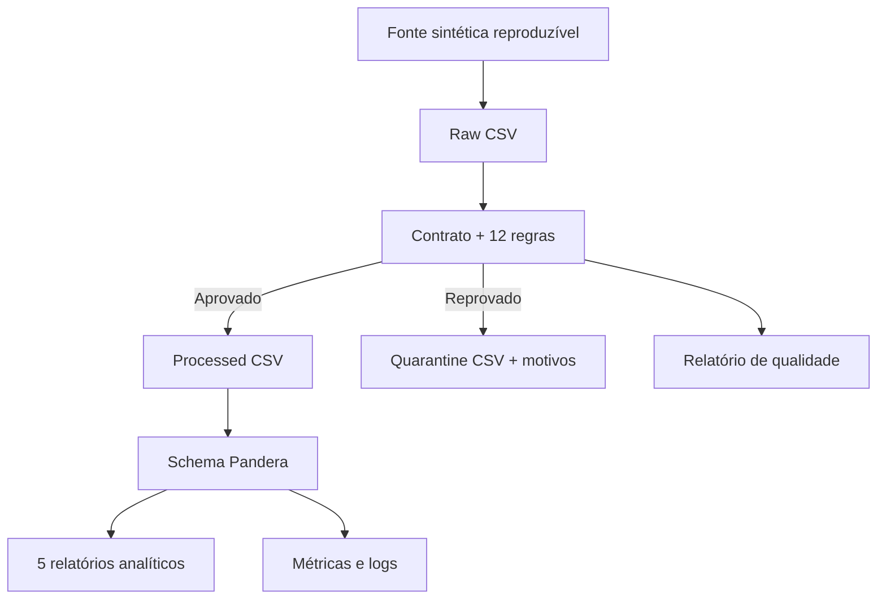

# E-Commerce Data Quality Pipeline

[](https://github.com/Victorvanzella/E-Commerce-Data-Quality-Pipeline-Python-Pandas/actions/workflows/ci.yml)


Pipeline de qualidade de dados que transforma pedidos brutos de e-commerce em dados confiáveis para análise. O projeto implementa contrato de dados versionado, 12 regras executáveis, quarentena com rastreabilidade, validação de schema, métricas operacionais, testes automatizados e CI/CD.

> Os dados são sintéticos e reproduzíveis. A arquitetura simula um fluxo real de ingestão em lote sem depender de banco de dados ou serviços pagos.

## Resultado da execução padrão

| Métrica | Resultado esperado |
|---|---:|
| Pedidos válidos gerados | 10.000 |
| Registros brutos | 10.055 |
| Registros aprovados | 10.000 |
| Registros em quarentena | 55 |
| Taxa de aceitação | 99,4530% |
| Regras avaliadas no dataset limpo | 12 |
| Regras aprovadas | 12 |
| Visões analíticas geradas | 5 |

As 55 falhas são inseridas de forma controlada. Assim, o pipeline pode ser testado com um resultado conhecido em vez de apenas executar sobre dados sempre perfeitos.

## Problema de negócio

Pedidos com identificadores duplicados, datas inválidas, preços não numéricos ou totais inconsistentes contaminam indicadores de receita e operação. Descartá-los silenciosamente também impede auditoria e correção na origem.

Este projeto adota três decisões:

1. valida a entrada contra um contrato explícito;
2. encaminha registros inválidos para uma quarentena com todos os motivos de rejeição;
3. libera para análise somente dados que passam pelas regras e pelo schema tipado.

## Arquitetura



O pipeline falha explicitamente quando o dataset limpo viola o schema ou quando a taxa de aceitação fica abaixo do limite configurado.

## Implementações principais

- geração de 10.000 pedidos coerentes com seed configurável;
- injeção de 55 anomalias em 11 cenários conhecidos;
- contrato YAML versionado com colunas, domínios e limites;
- 12 regras nas dimensões de schema, completude, unicidade, validade e consistência;
- separação entre `raw`, `processed` e `quarantine`;
- múltiplos motivos de rejeição por registro;
- schema final validado com Pandera;
- quality gate configurável por variável de ambiente;
- cinco datasets analíticos para consumo de negócio;
- escrita atômica dos relatórios JSON;
- logs com `run_id` para rastrear cada execução;
- 23 testes com cobertura superior a 90%;
- lint, testes, smoke test e evidências executados no GitHub Actions.

## Regras de qualidade

| # | Regra | Dimensão | Ação quando falha |
|---:|---|---|---|
| 1 | colunas obrigatórias presentes | Schema | interrompe a extração |
| 2 | `order_id` preenchido | Completude | quarentena |
| 3 | `order_id` único | Unicidade | quarentena da ocorrência duplicada |
| 4 | `customer_id` preenchido | Completude | quarentena |
| 5 | `order_date` é uma data válida | Validade | quarentena |
| 6 | `quantity >= 1` | Validade | quarentena |
| 7 | `quantity <= 100` | Validade | quarentena |
| 8 | `unit_price > 0` | Validade | quarentena |
| 9 | `0 <= discount_pct <= 0.5` | Validade | quarentena |
| 10 | status pertence ao domínio | Validade | quarentena |
| 11 | categoria pertence ao domínio | Validade | quarentena |
| 12 | total corresponde a quantidade × preço × desconto | Consistência | quarentena |

Detalhes e critérios estão em [docs/quality_rules.md](docs/quality_rules.md).

## Stack

- Python 3.11/3.12
- Pandas e NumPy
- Pandera
- PyYAML
- Pytest e pytest-cov
- Ruff
- GitHub Actions

## Como executar

### 1. Preparar o ambiente

```bash
git clone https://github.com/Victorvanzella/E-Commerce-Data-Quality-Pipeline-Python-Pandas.git
cd E-Commerce-Data-Quality-Pipeline-Python-Pandas
python -m venv .venv
```

Windows PowerShell:

```powershell
.venv\Scripts\Activate.ps1
python -m pip install -r requirements-dev.txt
```

Linux/macOS:

```bash
source .venv/bin/activate
python -m pip install -r requirements-dev.txt
```

### 2. Executar o pipeline completo

```bash
python -m src.pipeline
```

Resultado no terminal:

```text
Pipeline concluida: 10000 aceitos, 55 em quarentena, taxa de 99.453%.
```

### 3. Verificar as saídas

```bash
python -m src.verify_outputs
```

### 4. Executar testes e lint

```bash
pytest --cov=src --cov-report=term-missing
ruff check .
ruff format --check .
```

Também é possível usar `make pipeline`, `make validate`, `make test` e `make lint` em ambientes com Make.

## Opções de execução

```bash
# Gera outra quantidade de pedidos com uma seed específica
python -m src.pipeline --rows 20000 --seed 123

# Processa um arquivo já existente em data/raw/sales_orders_raw.csv
python -m src.pipeline --skip-generate

# Remove somente artefatos gerados pelo pipeline
python -m src.clean_outputs
```

Para processar uma fonte própria, mantenha as colunas do contrato em [`contracts/sales_orders.yml`](contracts/sales_orders.yml).

## Saídas geradas

| Caminho | Conteúdo |
|---|---|
| `data/raw/sales_orders_raw.csv` | fonte recebida sem tratamento |
| `data/processed/sales_orders_clean.csv` | pedidos aprovados e tipados |
| `data/quarantine/sales_orders_quarantine.csv` | linhas rejeitadas e seus motivos |
| `reports/data_quality_report.json` | resultados por regra e dimensão |
| `reports/pipeline_metrics.json` | métricas da execução e do negócio |
| `reports/revenue_by_category.csv` | receita reconhecida por categoria |
| `reports/revenue_by_product.csv` | desempenho por produto |
| `reports/daily_sales.csv` | série diária de pedidos e receita |
| `reports/delivery_status.csv` | distribuição operacional dos pedidos |
| `reports/customer_summary.csv` | resumo por cliente e país |
| `logs/pipeline.log` | eventos da execução com `run_id` |

Pedidos cancelados permanecem no dataset confiável, mas são excluídos da métrica de receita reconhecida.

## Estrutura do repositório

```text
.
├── .github/workflows/ci.yml
├── contracts/sales_orders.yml
├── data/
│   ├── raw/
│   ├── processed/
│   └── quarantine/
├── docs/
├── reports/
├── src/
│   ├── data_quality/
│   │   ├── engine.py
│   │   ├── reporting.py
│   │   └── schema.py
│   ├── analytics.py
│   ├── config.py
│   ├── contracts.py
│   ├── extract.py
│   ├── generate_data.py
│   ├── pipeline.py
│   └── transform.py
└── tests/
```

## CI/CD

A cada `push` ou pull request para `main`, o workflow:

1. instala as dependências em um ambiente limpo;
2. verifica lint e formatação;
3. executa os testes exigindo no mínimo 85% de cobertura;
4. roda o pipeline com 10.000 pedidos;
5. valida contagens, unicidade, motivos de quarentena e quality gate;
6. publica relatórios e logs como artefatos temporários da execução.

## Documentação técnica

- [Arquitetura e decisões](docs/architecture.md)
- [Contrato de dados](docs/data_contract.md)
- [Catálogo de regras](docs/quality_rules.md)
- [Runbook de operação](docs/runbook.md)

## Limites assumidos

- execução local e em lote, adequada ao volume demonstrativo;
- arquivos CSV como interface de entrada e saída;
- dados sintéticos, sem informações pessoais reais;
- valores monetários em uma moeda única para simplificar o caso;
- quarentena requer decisão humana ou correção no sistema de origem.

Em um ambiente produtivo, as próximas evoluções seriam armazenamento em objeto, particionamento, catálogo de metadados, alertas, execução incremental e integração com uma ferramenta de orquestração.

## Origem acadêmica

O cenário inicial foi inspirado no Mini-Projeto 4 do curso *Fundamentos de Linguagem Python — Do Básico a Aplicações de IA*, da Data Science Academy. A arquitetura, o contrato, a geração reproduzível, a quarentena, o schema, a observabilidade, os testes e a automação foram desenvolvidos para transformar o exercício em um projeto completo de portfólio.

## Licença

Distribuído sob a licença MIT. Consulte [LICENSE](LICENSE).
